# Cisco ISE Network Access Control & RADIUS Authentication Lab 

A Cisco Identity Services Engine (ISE) 3.5 deployment built on Microsoft Azure, paired with a Ubuntu RADIUS client, to demonstrate network access control, RADIUS authentication, and identity-based authorization — the kind of work a NOC or network security engineer handles day to day. The project is broken into phases, documented as a build → configure → verify walkthrough for each.

## Environment

|  |  |
|---|---|
| **Cloud platform** | Microsoft Azure |
| **Network** | VNet `10.0.1.0/24`, single subnet, NSG restricting inbound to required ports |
| **ISE node** | `isenode1` — Cisco ISE 3.5, `10.0.1.4` |
| **RADIUS client** | `radius-client01` — Ubuntu Linux, `10.0.1.5` |

## Phases

| # | Phase |
|---|---|
| 01 | [Azure Infrastructure Setup](#phase-01--azure-infrastructure-setup) |
| 02 | [Cisco ISE Deployment](#phase-02--cisco-ise-deployment) |
| 03 | [Identity & Policy Configuration](#phase-03--identity--policy-configuration) |
| 04 | [RADIUS Client Setup](#phase-04--radius-client-setup) |
| 05 | [RADIUS Authentication Testing](#phase-05--radius-authentication-testing) |
| — | [Troubleshooting Highlights](#troubleshooting-highlights) |

---

## Phase 01 — Azure Infrastructure Setup

**Goal:** Stand up an isolated Azure network to host the lab, with a Network Security Group scoped to only the traffic the lab needs.

### Build

Created the resource group, then a VNet on `10.0.1.0/24` with a single subnet, and a Network Security Group with inbound rules restricted to the lab's required ports.

*Resource group created — the container for every resource in this lab.*
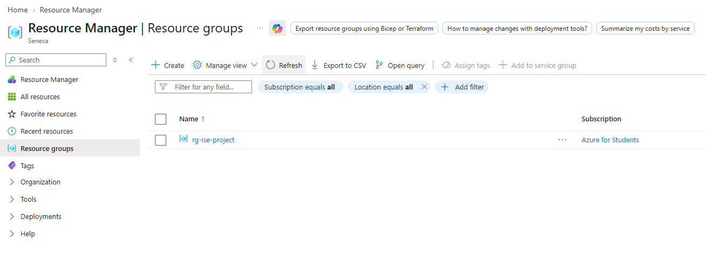

*VNet provisioned on `10.0.1.0/24` with a single subnet for the lab.*

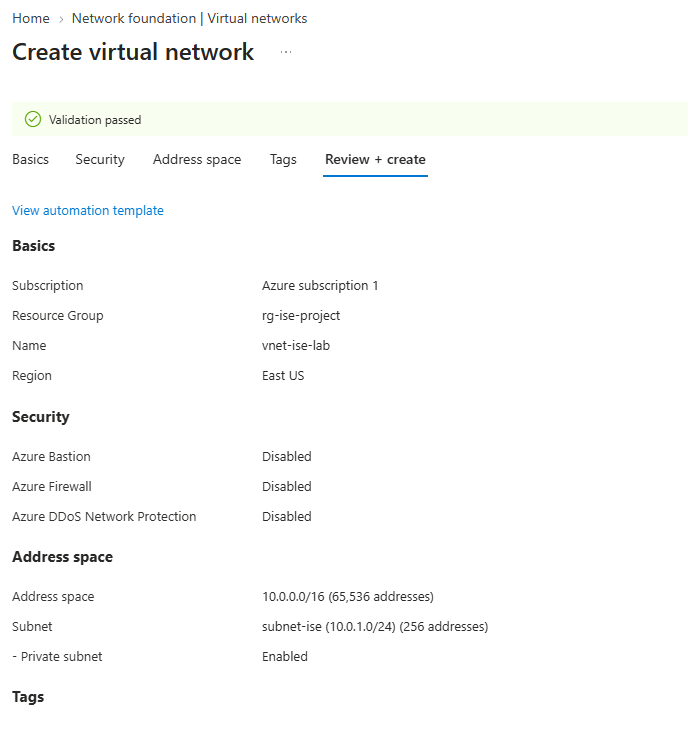

*Network Security Group created to scope traffic into the lab.*

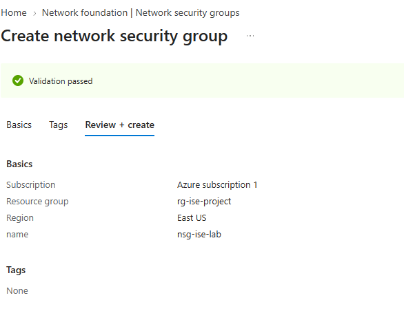

*Inbound rules restricted to the ports the lab actually needs.*

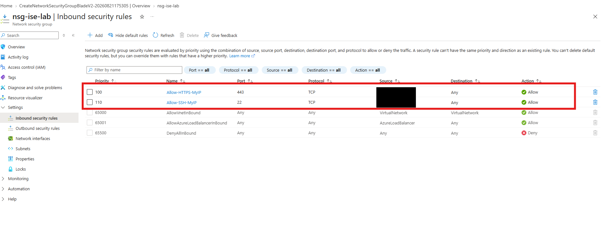

### Verify

Attached the NSG to the subnet, confirming the lab network is now isolated behind it.

*NSG attached to the subnet — traffic is now filtered at the network boundary.*
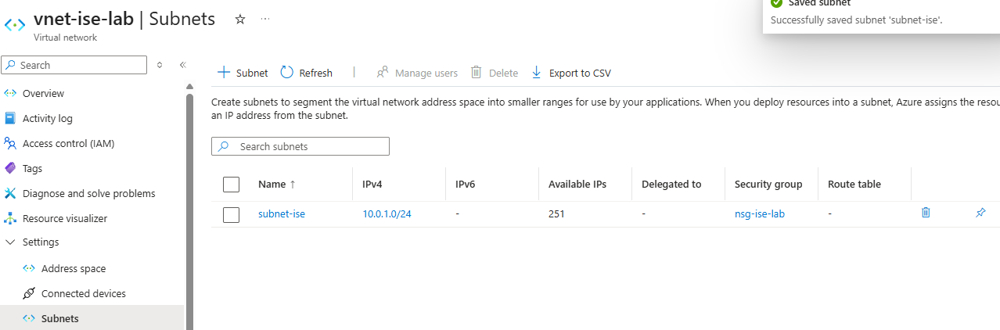

**Outcome:** A dedicated, isolated VNet exists for the lab, with traffic controlled at the subnet boundary by the NSG.

---

## Phase 02 — Cisco ISE Deployment

**Goal:** Deploy Cisco ISE 3.5 as the lab's Administration, Policy Service, and Monitoring node.

### Build

Deployed `isenode1` into the lab VNet and confirmed it was up and reachable, then reviewed the route table and ran connectivity tests.

*`isenode1` deployed and running in the lab VNet.*
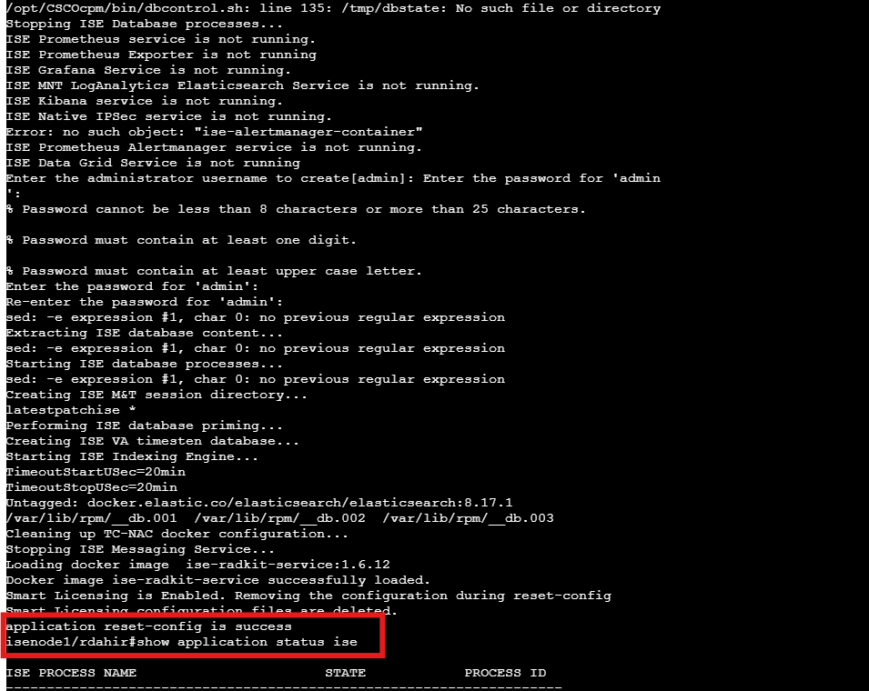

*Route table reviewed and connectivity to the ISE node confirmed.*
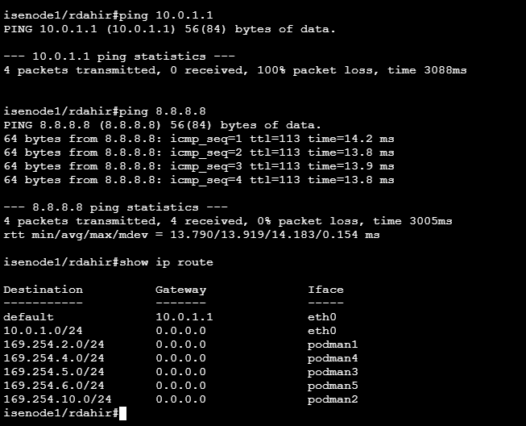

### Verify

Confirmed the ISE admin web UI was reachable, then walked through the initial admin password setup and the ISE setup wizard.

*ISE admin web UI reachable over the network.*
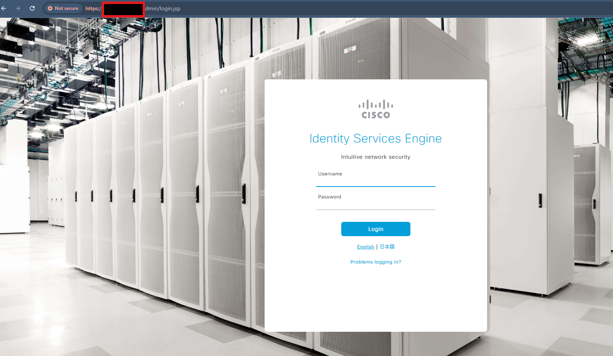

*First-login prompt to set the admin password.*
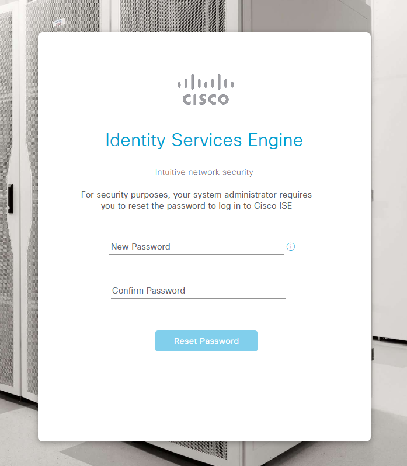

*Working through the ISE setup wizard to finish initial configuration.*
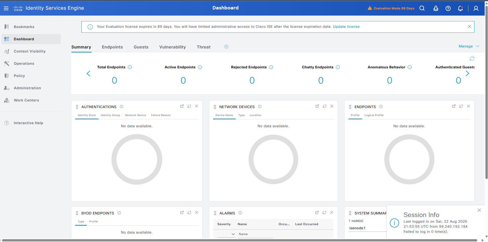

**Outcome:** `isenode1` is deployed and reachable, with Administration, Policy Service, and Monitoring personas enabled.

---

## Phase 03 — Identity & Policy Configuration

**Goal:** Configure ISE's internal identity store and build authentication/authorization policies that distinguish employee access from guest access.

### Build

Created three internal test users and identity groups, then built an authentication policy against the internal identity store and an authorization policy split between full employee access and scoped `GuestType_Daily` guest access.

*Three internal test users created in ISE's identity store.*
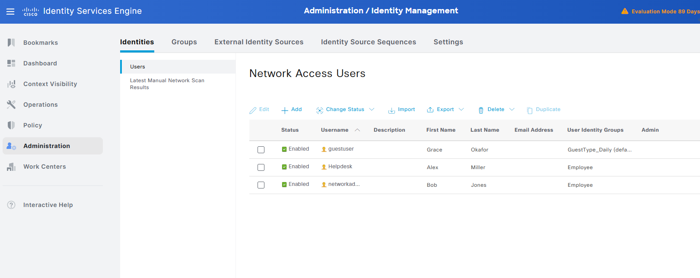

*Authorization policy split between employee access and `GuestType_Daily` guest access.*
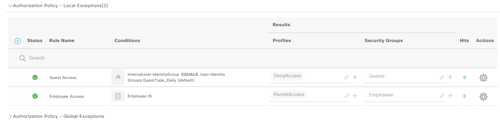

*Authentication policy validating users against the internal identity store.*
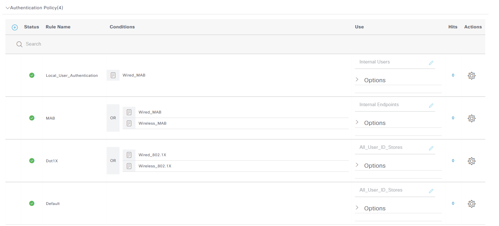

**Outcome:** ISE can authenticate a user against its internal store and route them to the correct authorization result based on identity group.

---

## Phase 04 — RADIUS Client Setup

**Goal:** Stand up a Linux host as a RADIUS client and register it as a trusted device in ISE.

### Build

Deployed `radius-client01`, confirmed SSH access, and verified connectivity to ISE with `netcat` and `ping` before installing RADIUS testing utilities.

*`radius-client01` created and deployed on the same VNet as ISE.*
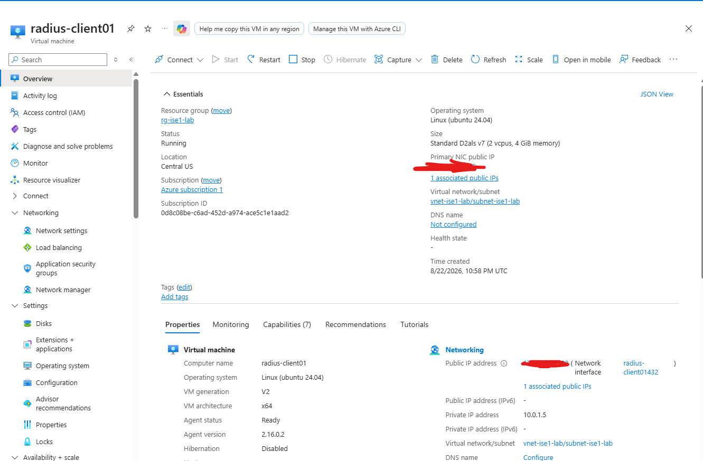

*SSH access confirmed to the RADIUS client VM.*
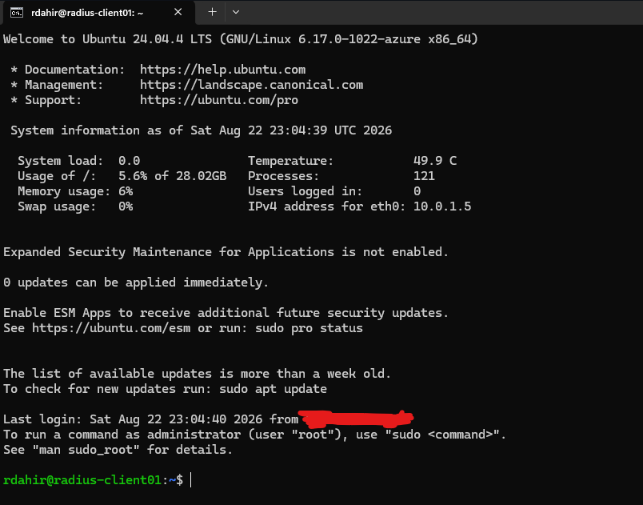

*`netcat` used to sanity-check connectivity toward the ISE node.*
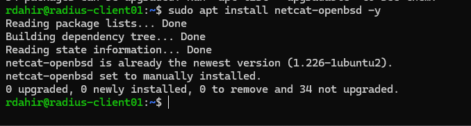

*Ping test confirming basic reachability from client to ISE.*
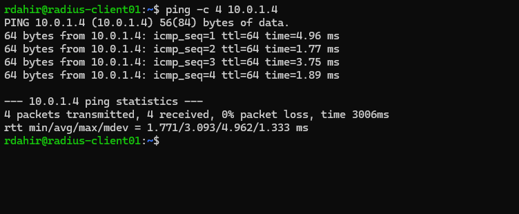

*RADIUS client tooling (`radtest` and friends) installed on the Ubuntu VM.*
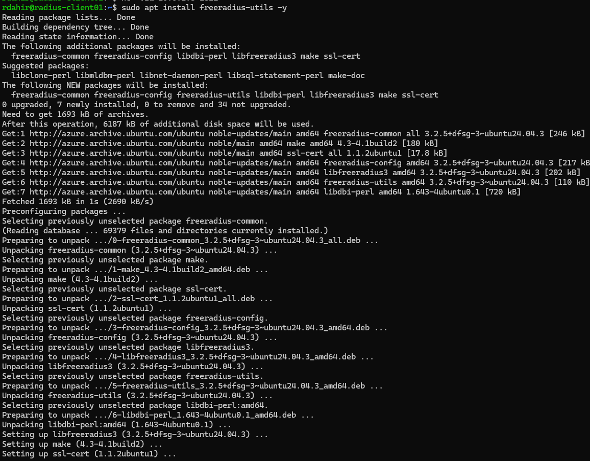

**Outcome:** `radius-client01` can reach `isenode1` over the network and has the tooling needed to send RADIUS requests.

---

## Phase 05 — RADIUS Authentication Testing

**Goal:** Prove the full RADIUS round trip end to end — request sent, user authenticated, authorization decision returned.

### Build

Registered `radius-client01` as a trusted network device in ISE with a shared RADIUS secret.

*`radius-client01` added to ISE as a trusted network device.*
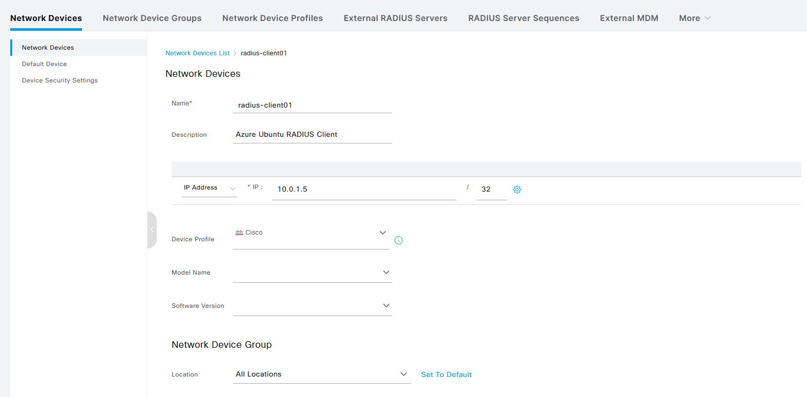

*Shared RADIUS secret configured between the client and ISE.*
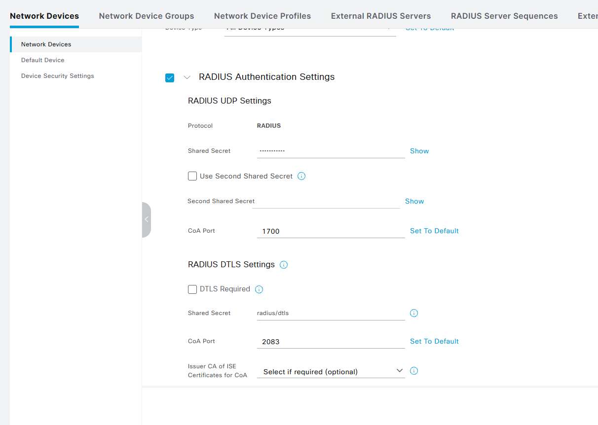

### Verify

Ran `radtest` from the client and got back an `Access-Accept`, including a Cisco TrustSec Security Group Tag — confirming ISE authenticated the user and returned enriched authorization data, not just a bare accept. Repeated the test against the guest-scoped policy, which correctly rejected access outside its intended scope.

*`radtest` returns `Access-Accept`, with a TrustSec SGT included in the response.*
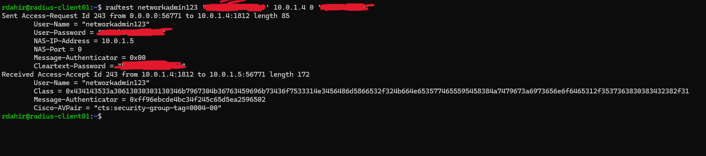

*Guest-scoped authentication test, correctly rejected outside its intended access.*
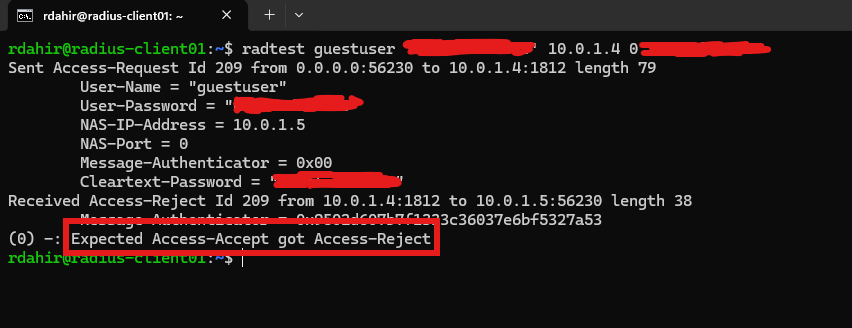

### Verify at the packet level
 
Captured RADIUS traffic between the client and ISE with `tshark` to confirm the `radtest` results weren't just client-side output — the actual wire traffic shows the Access-Accept and Access-Reject exchanges. Cross-checked against the ISE policy board, where the Employee Access rule shows a live hit count, confirming the rule that actually matched the request.
 
*`tshark` capture on `radius-client01` showing the Access-Request / Access-Accept exchange on the wire.*
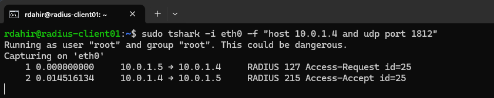
 
*`tshark` capture showing an Access-Request / Access-Reject exchange, confirming the rejection at the packet level, not just in client output.*
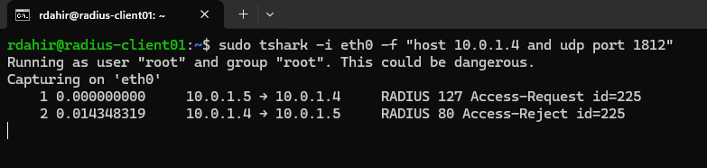
 
*ISE policy board showing the Employee Access rule registering a hit, confirming which rule actually matched the request.*
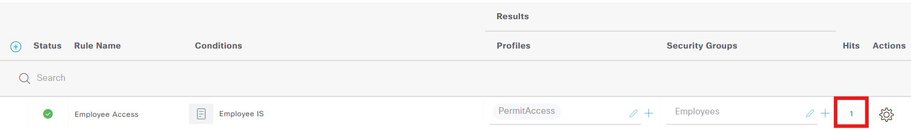
 
**Outcome:** RADIUS authentication and identity-based authorization both work end to end, including TrustSec SGT data in the response, confirmed independently at both the packet level and the policy engine level.
 
---

## Troubleshooting Highlights

- **Authorization rules won't save on incomplete conditions.** ISE refused to save `Local_User_Authentication`, `Guest_Access`, and `Employee_Access` because their rule conditions weren't fully configured. Working through the Library/Editor condition builder — adding `Wired_MAB` to the authentication rule and identity-group conditions to the employee/guest rules — made it clear how ISE actually evaluates a rule before applying a result, rather than just accepting whatever's typed in.
- **Not every VM size is available in every region.** B-series wasn't available for the RADIUS client VM in this region, so I compared the available D-series options on CPU, RAM, disk, and cost instead. A separate SSH connection failure turned out to be an incorrectly entered PowerShell environment variable for the private key path, not an actual access problem — correcting the path fixed it.
- **A monitoring problem and an authentication problem are not the same problem.** RADIUS authentication succeeded end to end (`radtest` returned `Access-Accept`), but ISE's Live Logs dashboard showed no entries. Rather than assuming RADIUS itself was broken, I checked the response in detail — `Access-Accept`, correct `User-Name`, and a valid TrustSec SGT in `Cisco-AVPair` — which confirmed authentication was genuinely working. That let me isolate Live Logs as a separate Monitoring/UI issue (compounded by known issues in early ISE 3.5.0.527 builds) instead of tearing down a working RADIUS configuration to chase it. Confirmed the Monitoring persona was enabled and AAA Audit logging was set to use the LogCollector; root cause not yet found and tracked as an open item.

## Roadmap — Next Phase

- [ ] Deploy a Windows Server VM as an Active Directory Domain Controller + DNS server
- [ ] Create organizational users and security groups in AD
- [ ] Integrate Active Directory with Cisco ISE as an external identity source
- [ ] Rebuild authorization policies around AD group membership instead of local ISE identity groups
- [ ] Resolve the Live Logs / Monitoring issue above
